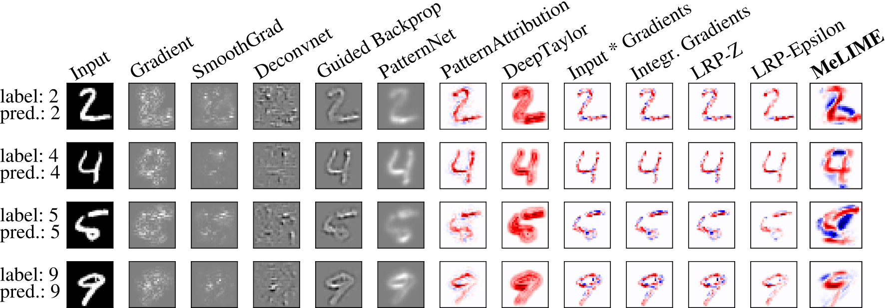

# MeLIME - Meaningful Local Explanation for Machine Learning Models

In this project,  we introduce strategies to improve local explanations taking into account the  distribution  of  the  data (on the manifold) used  to  train  the  black-box models. MeLIME, produces more meaningful explanations compared to other techniques over different ML models,  operating on various types of data.  MeLIME generalizes the LIME (https://github.com/marcotcr/lime) method, allowing more flexible perturbation sampling and the use of  different  local  interpretable  models.   Additionally,  we  introduce modifications  to standard training algorithms of local interpretable models fostering more robust explanations,  even  allowing  the  production  of counterfactual  examples.

The preprint of the paper is available on https://arxiv.org/abs/2009.05818


## How to install using python virtual environment

```
git clone https://github.com/tiagobotari/melime.git
cd melime
python3.7 -m venv venv
source venv/bin/activate
python setup.py install 
```

## Examples

The examples are on experiments folder and can be run using jupyter notebook.  

```
pip install jupyter
jupyter notebook
```

then open one of the experiment files.


### Regression Problem: Toy Model - Spiral Length
Data generated from a toy model- Length of Spiral. The color scale corresponds to the predictedvalues of a MPL model. The red star represents a data point $x^∗= (0,8)$, and the gray points the sampled data from KDEGen.Explanations produced for an instance $x^*$ using MeLIME methodology with KDEGen and a linear model as local model.


Go to this [example](doc/html/ex_image_vae_mnist.html).

### Classification Problem: Iris Dataset

Local explanation for an instance $x^∗=(6.0,3.0,5.0,1.5)$ produced by an RF model trained on the Iris dataset. MeLIME using KDEPCAGen and a linear model as local model; MeLIME using KDEPCAGen and a decision tree as local model.


Go to this [example](doc/html/ex_lime_tabular_classification_density_kde_pca_kpca_iris.html).

###  Classification of Images: MNIST Dataset

 MeLIME local explanations produced for a CNN model trained over the MNIST dataset. An image (numberfive) and the produced explanations with counterfactual examples  for  the  top  three  predictions:  (a)  number  five;  (b) number six; and (c) number eight.


Go to this [example](doc/html/ex_image_vae_mnist.html).

### Sentiment Analysis Texts: Movie-Review

A local explanation was produced using MeLIME for a Naive Bayes classifier model trained on sentences frommovie-reviews of the Rotten Tomatoes website (Website; Pang and Lee 2005). Words/positions showed as reddish color, if changed, are likely to turn the sentence negative while bluish color to become the sentence positive.


Go to this [example](ex_word2vec_rotten_tomatos.html).

### Running the Innvestigate experiment

MeLIME comparation with other methodologies for a CNN model trained on MNIST dataset:



The experiment in the file `melime/experiments/ex_mnist_cnn_innvestigate.py` needs the [`innvestigate`]() framework.
To install it, run the following command: 

```bash
> git submodule update --init
```
This will download the module to the directory `submodules/innvestigate`.

You may need to install tensorflow 1.15 and keras 2.3.1:

```
pip install tensorflow==1.15
pip install keras==2.3.1
```

Afterwards, the script can be run from the root directory: 

```bash
> python melime/experiments/ex_mnist_cnn_innvestigate.py
```

This will plot the result using `matplotlib`.
If you want to output a pdf, then prepend the command as follows:

```bash
> PLOTFILENAME="output.pdf" python melime/experiments/ex_mnist_cnn_innvestigate.py
```


